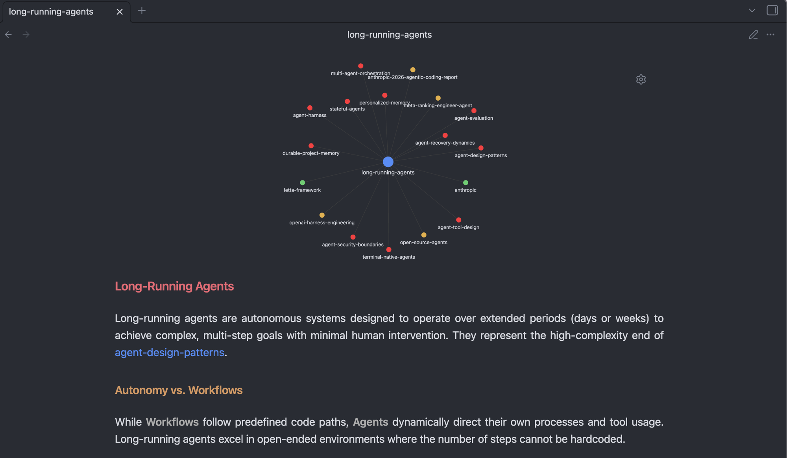
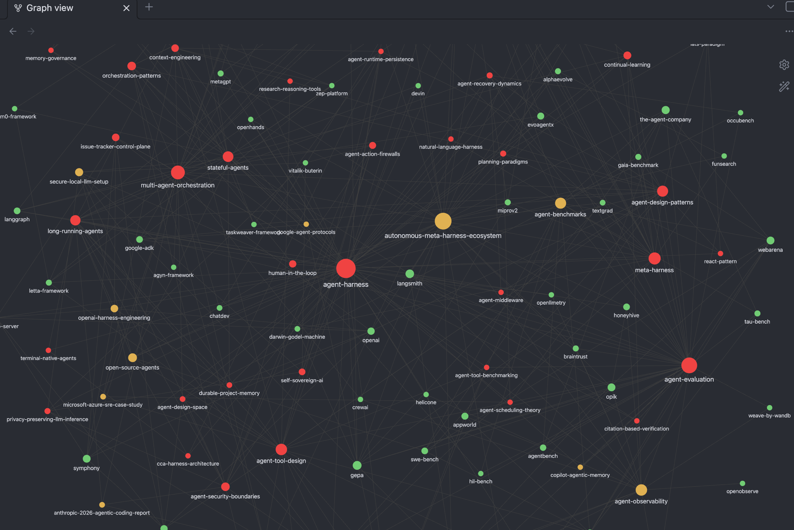

# Agenpedia

A markdown-first, harness-agnostic knowledge-base template. Fork it, install the skills, point any coding agent at it, and start ingesting your domain.

Works with Claude Code, Gemini CLI, OpenCode, Kilo Code, Pi, Codex, and any agent that supports the [`npx skills`](https://github.com/vercel-labs/skills) standard.

## What it is

Agenpedia is a structured wiki template based on three page types:

| Type | For |
|------|-----|
| **entity** | A person, org, tool, or named thing |
| **concept** | An idea, technique, or principle |
| **synthesis** | A distillation or thematic analysis of one or more sources |

Sources go into `raw/` (immutable). Agents read them, classify them, confront existing knowledge, verify claims, and produce wiki pages in `wiki/` with bidirectional `[[wikilinks]]`. Obsidian is the recommended viewer.

The schema is domain-neutral — point it at astrophysics, law, biology, or any other field and it works the same way.

## Quickstart

```bash
# 1. Clone as template
gh repo create my-wiki --template 0xjacq/Agenpedia --public && cd my-wiki

# 2. Install wiki skills for your coding agent(s)
npx skills add https://github.com/0xjacq/skills/tree/main/skills/agenpedia --all

# 3. (Optional) Install the pre-commit wikilink checker
git config core.hooksPath scripts/hooks

# 4. Drop sources into raw/
cp ~/Downloads/some-paper.pdf raw/

# 5. Open your coding agent and trigger the ingest skill
# In Claude Code:  "run the ingest skill on raw/some-paper.pdf"
# In Gemini CLI:   same
# In OpenCode:     same
```

## Supported Agents

Installed via `npx skills add`:

| Agent | Flag |
|-------|------|
| Claude Code | `claude-code` |
| Gemini CLI | `gemini-cli` |
| OpenCode | `opencode` |
| Kilo Code | `kilo` |
| Pi | `pi` |
| Codex | `codex` |

And [50+ more](https://github.com/vercel-labs/skills#supported-agents).

## Skills

| Skill | What it does |
|-------|-------------|
| `ingest` | Reads a source, classifies it, confronts existing wiki knowledge, verifies claims, and creates wiki pages |
| `ingest-batch` | Scans `raw/` for uncovered files, presents INGEST/SKIP/MERGE verdicts, then processes approved sources |
| `query` | Answers a natural language question using the wiki, optionally filing a synthesis page |
| `lint` | Checks wiki health: broken wikilinks, orphan pages, coverage gaps, contradictions |

Skills are hosted at [0xjacq/skills](https://github.com/0xjacq/skills).

## Obsidian setup (optional)





The repo ships a pre-configured Obsidian vault in `wiki/.obsidian/`:

- **Theme**: Minimal (install from Obsidian → Settings → Appearance → Browse)
- **Graph**: color-coded by page type — entity / concept / synthesis — with `index` and `log` filtered out
- **Plugins**: Dataview, Minimal Theme Settings, Style Settings, Graph Banner, Sync Graph Settings

Plugin binaries are not committed to git. Install them with:

```bash
./scripts/setup-obsidian.sh   # requires curl + jq
```

Then open `wiki/` as a vault in Obsidian, enable community plugins, and install the Minimal theme from the theme browser.

If you prefer your own Obsidian setup, simply delete or ignore `wiki/.obsidian/` — the wiki works as plain markdown regardless.

## Schema

See [AGENTS.md](./AGENTS.md) for the full schema: directory structure, page types, frontmatter, naming conventions, cross-reference rules, index and log formats.

## License

MIT
